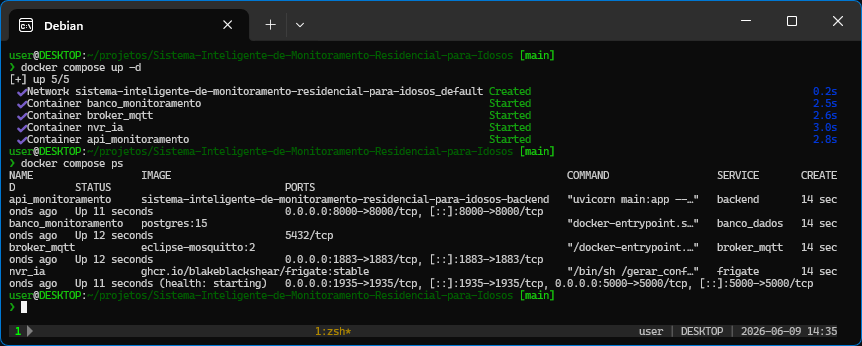
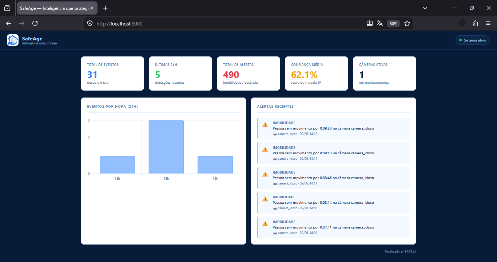
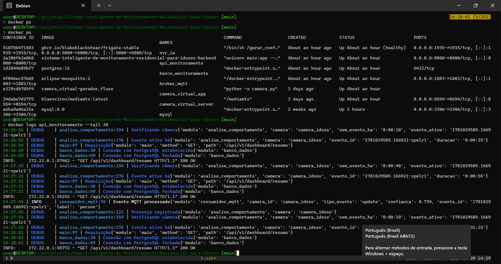
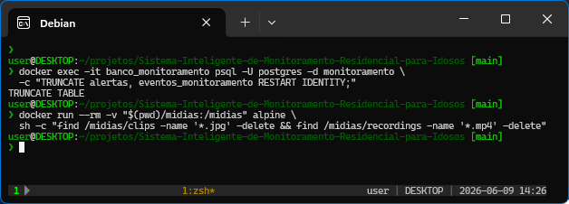

# 🛡️ SafeAge — Sistema Inteligente de Monitoramento Residencial para Idosos

> **"Inteligência que protege"**

[](https://www.python.org/)
[](https://fastapi.tiangolo.com/)
[](https://docs.docker.com/compose/)
[](https://www.postgresql.org/)
[](https://frigate.video/)
[](LICENSE)

---

## 📋 Sumário

1. [Identificação do Projeto](#1-identificação-do-projeto)
2. [Objetivo](#2-objetivo)
3. [Escopo](#3-escopo)
4. [Arquitetura do Sistema](#4-arquitetura-do-sistema)
5. [Requisitos Funcionais](#5-requisitos-funcionais)
6. [Requisitos Não Funcionais](#6-requisitos-não-funcionais)
7. [Estrutura de Pastas](#7-estrutura-de-pastas)
8. [Como Implantar](#8-como-implantar)
9. [Configuração do Ambiente](#9-configuração-do-ambiente)
10. [Testes](#10-testes)
11. [Logs e Monitoramento](#11-logs-e-monitoramento)
12. [Dashboard](#12-dashboard)
13. [API REST](#13-api-rest)
14. [Banco de Dados](#14-banco-de-dados)
15. [Regras de Negócio](#15-regras-de-negócio)
16. [Melhorias Futuras](#16-melhorias-futuras)
17. [Riscos e Mitigações](#17-riscos-e-mitigações)
18. [Equipe](#18-equipe)

---

## 1. Identificação do Projeto

| Campo | Valor |
|---|---|
| **Nome** | SafeAge — Sistema Inteligente de Monitoramento Residencial para Idosos |
| **Versão** | 1.1.0 |
| **Disciplina** | Projeto Integrador / Engenharia de Software |
| **Status** | ✅ Em produção (ambiente local containerizado) |
| **Repositório** | https://github.com/GerlanGuerreiro/SafeAge |
| **Tecnologia principal** | Python · FastAPI · PostgreSQL · MQTT · Frigate NVR · Docker |

---

## 2. Objetivo

O SafeAge é um sistema de monitoramento residencial com inteligência artificial para detecção de comportamentos anômalos em idosos. O sistema usa uma câmera IP/RTSP integrada ao Frigate NVR (detector YOLO) e analisa continuamente dois padrões de risco:

- **Imobilidade prolongada** — pessoa presente no frame sem movimento por tempo configurado
- **Ausência prolongada** — nenhuma detecção de presença por tempo configurável

Quando um padrão de risco é identificado, o sistema dispara alertas automáticos via **Telegram** (com snapshot da câmera) e registra tudo em um **dashboard web** em tempo real.

---

## 3. Escopo

### ✅ Incluído

- Detecção de presença via câmera RTSP com modelo YOLO (CPU)
- Análise comportamental autônoma com dois limiares configuráveis
- Alertas em tempo real via Telegram com foto snapshot
- Dashboard web responsivo com métricas, gráfico por hora e alertas recentes
- Persistência em banco PostgreSQL
- Containerização completa com Docker Compose
- Rate limiting configurável para evitar spam de notificações
- Limpeza automática de snapshots após envio

### ❌ Fora do escopo (v1.0)

- Reconhecimento facial individual
- Integração com serviços de emergência (SAMU, bombeiros)
- App mobile nativo
- Suporte a múltiplas residências simultâneas via nuvem
- Aceleração por GPU (roda somente em CPU)

---

## 4. Arquitetura do Sistema

### 4.1 Diagrama de Fluxo

```
Câmera IP (RTSP)
        │
        ▼
  Frigate NVR  ──── YOLO (CPU) ──── Detecção de objetos
        │
        │  MQTT (frigate/events)
        ▼
  Broker MQTT (Mosquitto)
        │
        ▼
  Backend FastAPI
  ├── consumidor_mqtt.py    → recebe eventos da câmera
  ├── analise_comportamento.py → detecta imobilidade / ausência
  ├── banco_dados.py        → persiste eventos e alertas
  ├── notificador.py        → envia alertas Telegram com snapshot
  └── api/routers/          → endpoints REST
        │
        ├──▶ PostgreSQL 15   (eventos_monitoramento, alertas)
        ├──▶ Telegram Bot    (notificações + foto)
        └──▶ Dashboard HTML  (polling 30s, Chart.js)
```

### 4.2 Arquitetura de Camadas

| Camada | Tecnologia | Responsabilidade |
|---|---|---|
| **Visão** | HTML + CSS + Chart.js | Dashboard web, polling 30s |
| **API** | FastAPI (Python 3.11) | Endpoints REST, lifespan, background tasks |
| **Lógica** | `analise_comportamento.py` | Motor comportamental, detecção de padrões |
| **Integração** | `consumidor_mqtt.py` | Consumo assíncrono de eventos MQTT |
| **Notificação** | `notificador.py` | Telegram Bot API, envio de foto + texto |
| **Persistência** | PostgreSQL 15 + psycopg2 | Armazenamento de eventos e alertas |
| **NVR / IA** | Frigate NVR + YOLO | Detecção de objetos em stream RTSP |
| **Mensageria** | Mosquitto MQTT | Comunicação Frigate → Backend |
| **Infraestrutura** | Docker Compose | Orquestração de todos os serviços |

### 4.3 Containers

| Container | Imagem | Porta | Função |
|---|---|---|---|
| `api_monitoramento` | build local | 8000 | Backend FastAPI |
| `banco_monitoramento` | postgres:15 | 5432 (interno) | Banco de dados |
| `broker_mqtt` | eclipse-mosquitto:2 | 1883 | Broker MQTT |
| `nvr_ia` | frigate:stable | 5000, 1935 | NVR + detecção IA |

---

## 5. Requisitos Funcionais

| ID | Requisito | Status |
|---|---|---|
| RF01 | O sistema deve detectar presença humana via câmera RTSP | ✅ |
| RF02 | O sistema deve identificar imobilidade prolongada (tempo configurável) | ✅ |
| RF03 | O sistema deve identificar ausência prolongada (tempo configurável) | ✅ |
| RF04 | O sistema deve enviar alertas via Telegram com mensagem formatada | ✅ |
| RF05 | O sistema deve enviar snapshot (foto) junto ao alerta quando disponível | ✅ |
| RF06 | O sistema deve exibir dashboard web com métricas em tempo real | ✅ |
| RF07 | O sistema deve persistir todos os eventos e alertas no banco | ✅ |
| RF08 | O sistema deve exibir gráfico de eventos por hora (últimas 24h) | ✅ |
| RF09 | O sistema deve exibir alertas recentes com horário correto | ✅ |
| RF10 | O sistema deve ter rate limiting configurável para Telegram | ✅ |
| RF11 | O sistema deve limpar snapshots após envio para não acumular arquivos | ✅ |
| RF12 | O sistema deve enviar notificação de startup pelo Telegram | ✅ |

---

## 6. Requisitos Não Funcionais

| ID | Requisito | Detalhe |
|---|---|---|
| RNF01 | **Disponibilidade** | Sistema deve operar continuamente (restart: unless-stopped) |
| RNF02 | **Performance** | Verificação comportamental a cada 30 segundos |
| RNF03 | **Portabilidade** | 100% containerizado via Docker Compose |
| RNF04 | **Segurança** | Credenciais isoladas em `.env`, nunca em código |
| RNF05 | **Observabilidade** | Logs estruturados com `structlog`, nível configurável |
| RNF06 | **Armazenamento** | Gravações limitadas por modo `motion`, retenção de 3 dias |
| RNF07 | **Fuso horário** | Todos os containers em `America/Manaus` (UTC-4) |
| RNF08 | **Manutenibilidade** | Configurações centralizadas em `core/config.py` (pydantic-settings) |

---

## 7. Estrutura de Pastas

```
SafeAge/
├── backend/
│   ├── analise_comportamento.py   # Motor comportamental (imobilidade / ausência)
│   ├── banco_dados.py             # Camada de acesso ao PostgreSQL
│   ├── consumidor_mqtt.py         # Consumidor assíncrono de eventos MQTT
│   ├── main.py                    # Aplicação FastAPI + lifespan
│   ├── modelos.py                 # Criação das tabelas no banco
│   ├── notificador.py             # Envio de alertas via Telegram Bot API
│   ├── requirements.txt           # Dependências Python
│   ├── Dockerfile                 # Imagem Docker do backend
│   ├── core/
│   │   ├── config.py              # Configurações centralizadas (pydantic-settings)
│   │   ├── logging_config.py      # Logging estruturado com structlog
│   │   └── __init__.py
│   └── api/
│       ├── routers/
│       │   └── eventos.py         # Endpoints REST de eventos e alertas
│       └── static/
│           ├── dashboard.html     # Dashboard web (Chart.js, polling 30s)
│           └── logo.jpeg          # Logo do sistema
├── frigate/
│   └── config.camera.yml          # Configuração do Frigate NVR
├── midias/
│   ├── clips/                     # Snapshots e clips dos eventos
│   ├── recordings/                # Gravações contínuas (modo motion)
│   └── exports/                   # Exportações manuais
├── scripts/
│   └── gerar_config_frigate.sh    # Script que injeta variáveis na config do Frigate
├── docker-compose.yml             # Orquestração de todos os serviços
├── .env                           # Variáveis de ambiente (NÃO versionar)
├── .gitignore
└── README.md
```

---

## 8. Como Implantar

O SafeAge é **100% containerizado**. Pode ser implantado em qualquer host que tenha Docker e Docker Compose instalados, incluindo:

- **Raspberry Pi 4 (4GB+)** — uso doméstico, baixo consumo
- **Mini PC / NUC** — maior desempenho, ideal para câmeras Full HD
- **Servidor Linux (VPS/bare-metal)** — ambiente de produção robusto
- **Notebook/Desktop** — desenvolvimento e testes
- **Windows com WSL2** — desenvolvimento local

### Pré-requisitos

```bash
# Docker Engine 24+
docker --version

# Docker Compose v2+
docker compose version
```

### Instalação em 4 passos

```bash
# 1. Clone o repositório
git clone https://github.com/GerlanGuerreiro/SafeAge.git
cd SafeAge

# 2. Crie o arquivo de configuração
cp .env.example .env
# Edite o .env com suas credenciais (câmera, Telegram, banco)

# 3. Suba todos os serviços
docker compose up -d

# 4. Acesse o dashboard
# http://localhost:8000
```
<p align="center">
  
</p>
<p align="center">
  
</p>

### Verificar se está tudo saudável

```bash
docker ps
# Todos os containers devem estar "healthy" ou "Up"

docker logs api_monitoramento --tail 20
# Deve exibir "SafeAge pronto para monitorar"
```
<p align="center">
  
</p>

---

## 9. Configuração do Ambiente

Copie `.env.example` para `.env` e preencha:

```env
# ── BANCO DE DADOS ──────────────────────────────────────────
USUARIO_BANCO=postgres
SENHA_BANCO=sua_senha_aqui
NOME_BANCO=monitoramento

# ── MQTT ────────────────────────────────────────────────────
ENDERECO_BROKER_MQTT=broker_mqtt
PORTA_BROKER_MQTT=1883

# ── TELEGRAM ────────────────────────────────────────────────
TELEGRAM_TOKEN=seu_token_aqui
TELEGRAM_CHAT_ID=seu_chat_id_aqui
TELEGRAM_RATE_LIMIT_MINUTOS=10    # 0 para testes

# ── CÂMERA RTSP ─────────────────────────────────────────────
CAMERA_USER=admin
CAMERA_PASS=senha_camera
CAMERA_HOST=192.168.0.X
CAMERA_PORT=8554
CAMERA_ENDPOINT=stream

# ── GERAL ───────────────────────────────────────────────────
TZ=America/Manaus
```

### Parâmetros comportamentais (em `backend/analise_comportamento.py`)

```python
TEMPO_IMOBILIDADE       = timedelta(minutes=5)    # Alerta se mesmo evento > 5 min
TEMPO_AUSENCIA          = timedelta(minutes=15)   # Alerta se sem detecção > 15 min
INTERVALO_VERIFICACAO_S = 30                      # Verifica a cada 30 segundos
JANELA_ANTI_SPAM_ALERTA = timedelta(minutes=30)   # Intervalo mínimo entre alertas no banco
```

---

## 10. Testes

### Testes funcionais manuais

#### Testar alerta de imobilidade
```bash
# 1. Coloque o sistema em modo de teste (zerando anti-spam)
# Em analise_comportamento.py: JANELA_ANTI_SPAM_ALERTA = timedelta(seconds=0)
# No .env: TELEGRAM_RATE_LIMIT_MINUTOS=0

# 2. Rebuild e suba
docker compose down && docker compose build backend && docker compose up -d

# 3. Fique parado na frente da câmera pelo tempo de TEMPO_IMOBILIDADE
# O alerta deve chegar no Telegram dentro de ~30s após o limiar

# 4. Monitore os logs em tempo real
docker logs -f api_monitoramento | grep -E "(Alerta|imobilidade|Snapshot)"
```

#### Testar alerta de ausência
```bash
# Saia do campo de visão da câmera pelo tempo de TEMPO_AUSENCIA
# Monitore:
docker logs -f api_monitoramento | grep "ausencia"
```

#### Testar snapshot no Telegram
```bash
# Verificar se o volume está mapeado corretamente
docker exec api_monitoramento ls /media/frigate/clips/ | grep ".jpg" | head -5

# Se não listar arquivos, verificar docker-compose.yml:
# volumes:
#   - ./midias/clips:/media/frigate/clips:ro
```

### Verificações de saúde

```bash
# Status geral
docker ps --format "table {{.Names}}\t{{.Status}}\t{{.Ports}}"

# Health check da API
curl http://localhost:8000/health

# Verificar banco de dados
docker exec -it banco_monitoramento psql -U postgres -d monitoramento \
  -c "SELECT COUNT(*) as eventos FROM eventos_monitoramento;"

docker exec -it banco_monitoramento psql -U postgres -d monitoramento \
  -c "SELECT id, tipo_alerta, criado_em FROM alertas ORDER BY id DESC LIMIT 5;"

# Verificar conectividade MQTT
docker logs broker_mqtt --tail 10
```

### Limpeza para novo ciclo de testes

```bash
# Limpar eventos e alertas do banco (manter estrutura)
docker exec -it banco_monitoramento psql -U postgres -d monitoramento \
  -c "TRUNCATE alertas, eventos_monitoramento RESTART IDENTITY;"

# Limpar mídias antigas
docker run --rm -v "$(pwd)/midias:/midias" alpine \
  sh -c "find /midias/clips -name '*.jpg' -delete && find /midias/recordings -name '*.mp4' -delete"
```
<p align="center">
  
</p>

---

## 11. Logs e Monitoramento

O SafeAge usa `structlog` para logging estruturado em formato legível, com contexto rico em cada linha.

### Formato dos logs

```
HH:MM:SS | LEVEL | módulo:linha | Mensagem{'campo': 'valor', ...}
```

### Comandos úteis

```bash
# Todos os logs do backend
docker logs -f api_monitoramento

# Filtrar apenas alertas e eventos comportamentais
docker logs -f api_monitoramento | grep -E "(Alerta|imobilidade|ausencia|Snapshot)"

# Filtrar erros
docker logs -f api_monitoramento | grep -E "(ERROR|WARNING|CRITICAL)"

# Logs do Frigate (detecções da IA)
docker logs -f nvr_ia | grep "person"

# Logs do MQTT
docker logs -f broker_mqtt
```

### Níveis de log por tipo de evento

| Nível | Evento |
|---|---|
| `DEBUG` | Presença registrada, verificação de câmera, conexões ao banco |
| `INFO` | Evento MQTT processado, evento salvo, Telegram enviado |
| `WARNING` | Alerta gerado e salvo no banco |
| `ERROR` | Falha de conexão, erro ao enviar Telegram |

---

## 12. Dashboard

Acessível em `http://localhost:8000` (ou IP do host na rede local).

### Métricas exibidas

| Card | Descrição |
|---|---|
| **Total de Eventos** | Todos os eventos desde o início |
| **Últimas 24h** | Detecções nas últimas 24 horas |
| **Total de Alertas** | Alertas gerados (imobilidade + ausência) |
| **Confiança Média** | Score médio do modelo YOLO nas últimas 24h |
| **Câmeras Ativas** | Câmeras com detecção nas últimas 24h |

### Componentes

- **Gráfico de eventos por hora** — barras agrupadas por hora no fuso `America/Manaus`
- **Alertas recentes** — últimos 5 alertas com tipo, descrição, câmera e horário
- **Indicador de status** — verde (sistema ativo) / vermelho (falha na API)
- **Auto-atualização** — polling a cada 30 segundos

---

## 13. API REST

Base URL: `http://localhost:8000`

| Método | Endpoint | Descrição |
|---|---|---|
| `GET` | `/` | Dashboard HTML |
| `GET` | `/health` | Status do sistema |
| `GET` | `/api/v1/eventos` | Lista paginada de eventos (`?limite=50&offset=0&camera=`) |
| `GET` | `/api/v1/alertas` | Lista paginada de alertas |
| `GET` | `/api/v1/dashboard/resumo` | Métricas agregadas + alertas recentes + eventos por hora |

### Exemplo de resposta — `/api/v1/dashboard/resumo`

```json
{
  "total_eventos": 331,
  "total_alertas": 97,
  "eventos_24h": 13,
  "media_confianca": 0.622,
  "cameras_ativas": 1,
  "alertas_recentes": [
    {
      "tipo_alerta": "imobilidade",
      "camera": "camera_idoso",
      "descricao": "Pessoa sem movimento por 0:02:17 na câmera camera_idoso",
      "criado_em": "2026-05-14T09:43:40.188992"
    }
  ],
  "eventos_por_hora": [
    { "hora": "2026-05-14T08:00:00", "quantidade": 2 },
    { "hora": "2026-05-14T09:00:00", "quantidade": 8 }
  ]
}
```

---

## 14. Banco de Dados

### Tabela `eventos_monitoramento`

| Coluna | Tipo | Descrição |
|---|---|---|
| `id` | SERIAL PK | Identificador único |
| `tipo_evento` | VARCHAR(50) | `new`, `update`, `end` |
| `objeto_detectado` | VARCHAR(100) | `person` |
| `camera` | VARCHAR(100) | Nome da câmera |
| `inicio_evento` | TIMESTAMP | Início da detecção |
| `fim_evento` | TIMESTAMP | Fim da detecção |
| `duracao_segundos` | INTEGER | Duração em segundos |
| `confianca` | FLOAT | Score do modelo (0.0 a 1.0) |
| `evento_id_frigate` | VARCHAR(100) | ID único do Frigate |
| `criado_em` | TIMESTAMP | Timestamp de criação |

### Tabela `alertas`

| Coluna | Tipo | Descrição |
|---|---|---|
| `id` | SERIAL PK | Identificador único |
| `tipo_alerta` | VARCHAR(100) | `imobilidade` ou `ausencia_prolongada` |
| `camera` | VARCHAR(100) | Nome da câmera |
| `descricao` | TEXT | Descrição detalhada do alerta |
| `criado_em` | TIMESTAMP | Timestamp de criação |

---

## 15. Regras de Negócio

| Regra | Descrição |
|---|---|
| **RN01** | Imobilidade é detectada quando o mesmo `evento_id` do Frigate permanece ativo por mais de `TEMPO_IMOBILIDADE` |
| **RN02** | Ausência é detectada quando nenhum evento chega há mais de `TEMPO_AUSENCIA` |
| **RN03** | Ao encerrar um evento (`end`), o anti-spam de imobilidade daquela câmera é resetado |
| **RN04** | O anti-spam no banco (`JANELA_ANTI_SPAM_ALERTA`) é independente do rate limit do Telegram (`TELEGRAM_RATE_LIMIT_MINUTOS`) |
| **RN05** | Snapshots são apagados do disco imediatamente após envio pelo Telegram |
| **RN06** | A confiança média no dashboard considera apenas eventos das últimas 24h com score > 0 |
| **RN07** | Gravações do NVR são retidas por 3 dias, somente em modo `motion` |

---

## 16. Melhorias Futuras

| Prioridade | Melhoria |
|---|---|
| 🔴 Alta | Suporte a múltiplas câmeras simultâneas |
| 🔴 Alta | Detecção de quedas (pose estimation) |
| 🟡 Média | Reconhecimento facial para identificar o idoso monitorado |
| 🟡 Média | Relatórios diários/semanais automáticos via Telegram |
| 🟡 Média | App mobile para cuidadores (React Native) |
| 🟡 Média | Integração com serviços de emergência via API |
| 🟢 Baixa | Aceleração por GPU/NPU (Coral, CUDA) para maior FPS |
| 🟢 Baixa | Interface de configuração web (sem editar arquivos) |
| 🟢 Baixa | Multi-residência com painel centralizado em nuvem |
| 🟢 Baixa | Exportação de relatórios em PDF |

---

## 17. Riscos e Mitigações

| Risco | Probabilidade | Impacto | Mitigação |
|---|---|---|---|
| Câmera offline / perda de sinal | Média | Alto | Log de erro + alerta de ausência dispara após `TEMPO_AUSENCIA` |
| Falso positivo de imobilidade (pessoa dormindo) | Alta | Médio | Limiar configurável; cuidador valida antes de agir |
| Espaço em disco esgotado por gravações | Média | Alto | Modo `motion` + retenção 3 dias + script de limpeza |
| Token do Telegram expirado | Baixa | Alto | Log de erro explícito; rotação manual do token |
| Detecção incorreta pelo modelo YOLO | Média | Médio | Threshold de confiança + anti-spam evita alertas excessivos |
| Container fora do ar | Baixa | Alto | `restart: unless-stopped` em todos os serviços |

---

## 18. Equipe

| Nome | Função | GitHub | LinkedIn |
|---|---|---|---|
| **Gerlan Guerreiro** | Tech Lead & Backend | [github.com/GerlanGuerreiro](https://github.com/GerlanGuerreiro) | [linkedin.com/in/gerlan](https://linkedin.com/in/gerlan) |
| **Lucas Maia** | Desenvolvedor | [github.com/LucasMaia](https://github.com/lucasmaia27) | [linkedin.com/in/lucasmaia](www.linkedin.com/in/lucas-del-aguilla-dev) |
| **Gabriel Fernando** | Desenvolvedor | [github.com/GabrielFernando](https://github.com/GabrielF157) | [linkedin.com/in/GabrielFernando](https://www.linkedin.com/in/gabrielfernando-/) |
| **Miguel Antony** | QA & Testes | [github.com/MiguelAntony](https://github.com/MiguelAts) | [linkedin.com/in/MiguelAntony](https://www.linkedin.com/in/miguel-santos-248526303?utm_source=share&utm_campaign=share_via&utm_content=profile&utm_medium=android_app) |
| **João Gustavo** | DevOps & Infra | [github.com/JoaoGustavo](https://github.com/JoaoGustavoVasconcelos) | [linkedin.com/in/JoãoGustavo](https://www.linkedin.com/in/joao-gustavo-goncalves-vasconcelos) |
| **Enison Neves** | Documentação | [github.com/EnisonNeves](https://github.com/enisonevs) | [linkedin.com/in/enisonneves](https://www.linkedin.com/in/ennysson/) |
| **Luana Leal** | Orientadora | [github.com/ProfaLuanaLeal](https://github.com/ProfaLuanaLeal ) | [linkedin.com/in/LuanaLeal](https://www.linkedin.com/in/luanalealm/) |

---

## Registro de Alterações

| Versão | Data | Descrição |
|---|---|---|
| 0.1.0 | Mar/2026 | Estrutura inicial, integração Frigate + MQTT |
| 0.2.0 | Abr/2026 | Motor comportamental, alertas Telegram |
| 0.3.0 | Abr/2026 | Dashboard web, gráficos, fuso horário |
| 0.4.0 | Mai/2026 | Snapshots no Telegram, rate limit dinâmico, config Frigate otimizada |
| 1.0.0 | Mai/2026 | Versão estável — horários corrigidos, armazenamento controlado |
| 1.1.0 | Jun/2026 | Adção de Funcionalidade - Camera Virtual para testes, Imagens do Sistema |

---

<div align="center">
  <sub>SafeAge © 2026 — Desenvolvido como projeto acadêmico integrador</sub><br>
  <sub><i>"Inteligência que protege"</i></sub>
</div>
